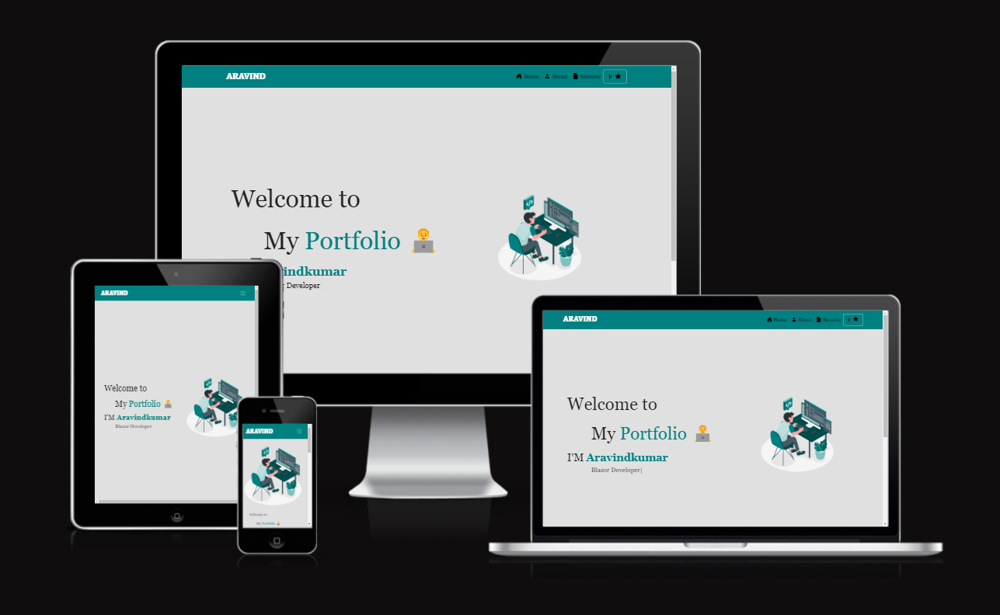

<h2 align="center">
  Blazor Portfolio 
  <a href="https://myself-aravind.vercel.app/" target="_blank">Myself-Aravind</a>
  

  

 

  

<h4 align="center">
    🐞
    <a href="https://github.com/myself-aravindkumar/Portfolio/issues">Submit Issue (Bug)</a> &nbsp; &nbsp;
    💡
    <a href="https://github.com/myself-aravindkumar/Portfolio/issues">Share Idea (Brainstorm)</a>
</h4>
  
## 🙌 Go Ahead, But Credit!
  
  Feel free to fork this repository and customize it as you like. I’d appreciate it if you give proper credit by linking back to Portfolio. Thanks!

## 🔨 How I Built This

  I created a personal website called <a href="https://myself-aravind.vercel.app/" target="_blank">Portfolio</a> to show my work, skills, and resume.

  This project was developed with the following technologies:

  🔹 Blazor  
  🔹 .Net Core  
  🔹 C#  
  🔹 HTML  
  🔹 CSS  
  🔹 Visual Studio  
  🔹 Vercel  

## Getting Started

### Prerequisites

  - Install Visual Studio 2022
  - Install .Net SDK 8

### Run the Project in Visual Studio

  1. Open Visual Studio.
  2. Clone the repository:
  3. Run button to build and launch the app using .NET 8 runtime.The app will open in your browser at https://localhost:44349
  4. Edit your .razor components inside the /Pages. After making changes, save your files, then rebuild and rerun the project in Visual Studio to see the updates in the browser

### How to Customize Your Portfolio

1. Modify pages in /Pages like Index.razor, About.razor, etc.
2. Update layout and shared components like MainLayout.razor, HeaderComponent.razor, and FooterComponent.razor.
3. Change styles in /wwwroot/css, adjust Bootstrap classes, or edit the separate CSS file used for the Home page.
4. Add your personal info, project details, and content directly inside the .razor files. After making changes, rebuild and rerun the project to see updates in the browser.

## Show Your Support

  If you like this portfolio, please ⭐ the repository!

